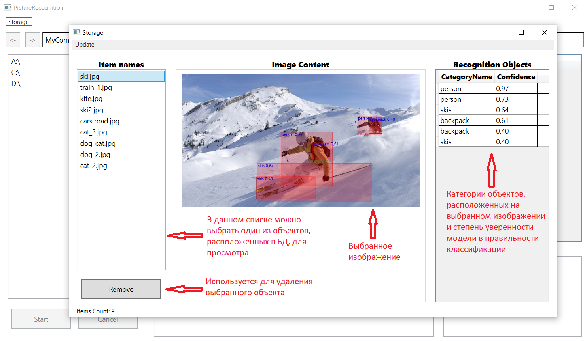
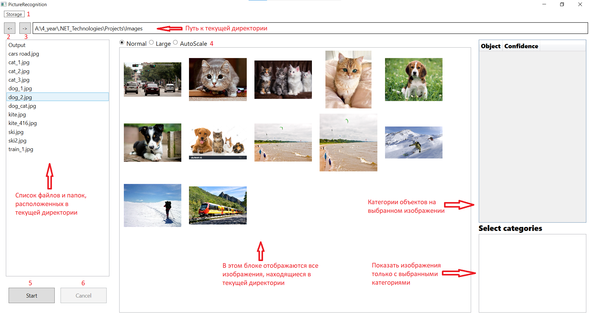
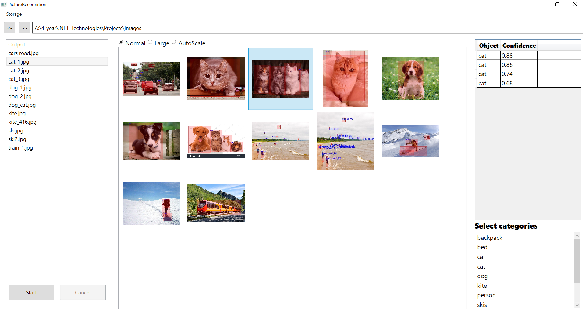
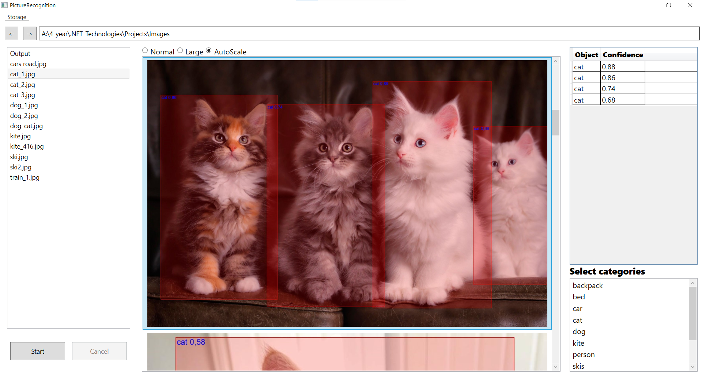
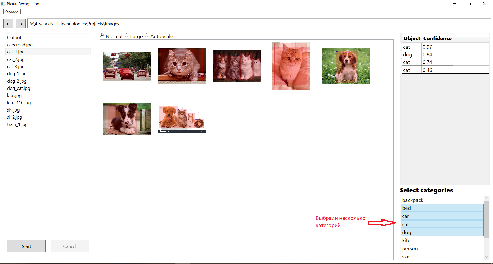

# Детекция объектов с UI

В данном репозитории расположено приложение для детекции объектов с пользовательским интерфейсом, 
разработанное на курсе "Технологии .Net" факультета ВМК. 

Для детекции объектов используется модель [Yolov4](https://github.com/onnx/models). Детекция объектов
для каждоого изображения происходит в отдельном потоке, box'ы появляются на изображениях по мере 
распознавания. Ниже приведено описание интерфейса приложения, и его основных функций.

При открытии приложения откроется сразу два окна: окно приложения и окно с содержимым базы данных, 
в которую сохраняются изображения с распознанными категориями на них. Окно с содержимым базы данных
устроено следующим образом:

Для просмотра изображения необходимо нажать на его имя в списке "Items Names", тогда оно отобразится
в средней части окна, а в таблице "Recognition Objects" отобразятся названия категорий объектов, 
расположенных на изображении и доверительная вероятность модели (насколько модель уверена в том, что
в конкретном box'е расположен объект именно распознанного класса).

Само окно приложения выглядит следующим образом:

Для выбора директории, в которой расположены изображения для детекции объектов, используется список,
находящийся у левого края окна.
Числами на изображении обозначены следующие кнопки:
1. Кнопка открытия хранилища для просмотра содержимого (окно, которое было рассмотрено выше);
2. Перемещение в предыдущую директорию;
3. Перемещение в следующую директорию, которая сохранилась в истории открытий;
4. Выбор размера показа изображений (AutoScale подстраивает изображения под размер окна);
5. Запуск детекции (после запуска на изображениях начнут появляться box'ы);
6. Прервать детекцию (все потоки прервут распознавание, уже распознанные объекты не удалятся).

После окончания распознавания можно будет увидеть следующую картину:

Для более пристального изучения изображений можно изменить их размер на "Large" или "AutoScale":

В таблице "Object Confidence" отображаются категории объектов на выбранном изображении и степень
уверенности модели, а в списке "Select categories" можно выбрать категории объектов, находящихся
на изображении. В случае выбора категорий в центре окна стунут отображаться лишь те изображения,
на которых содержатся объекты выбранных категорий:

